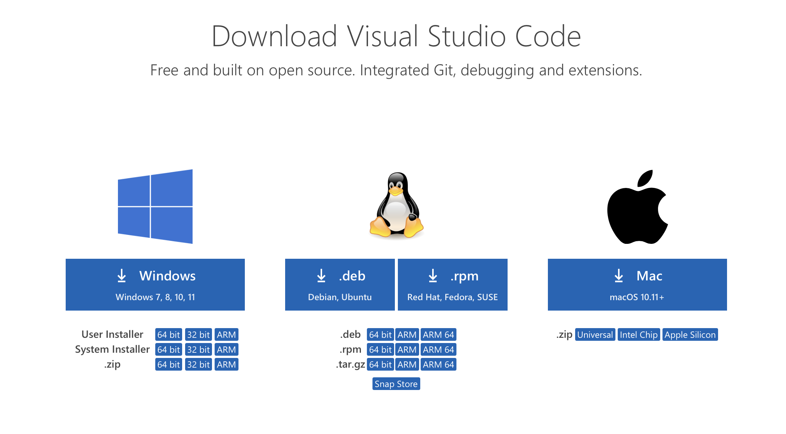
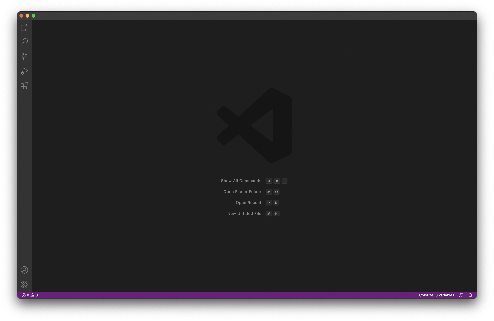
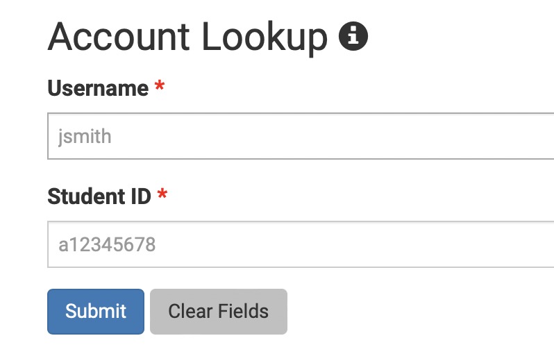
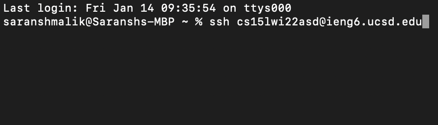
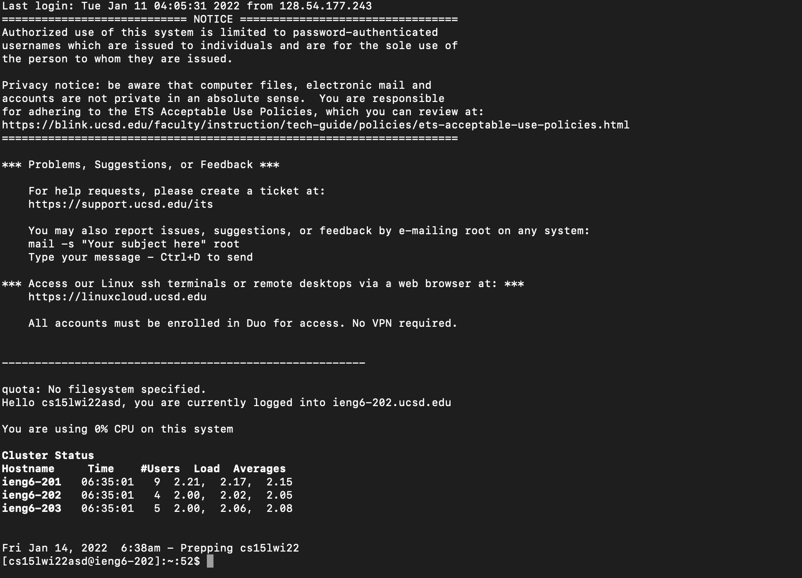
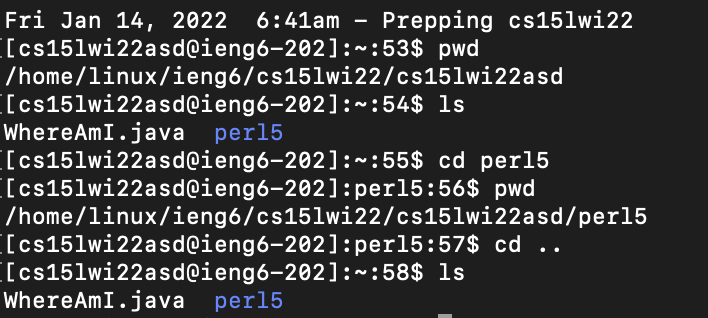
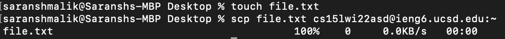
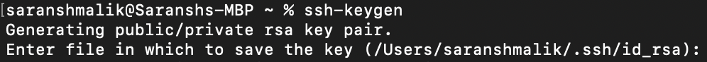
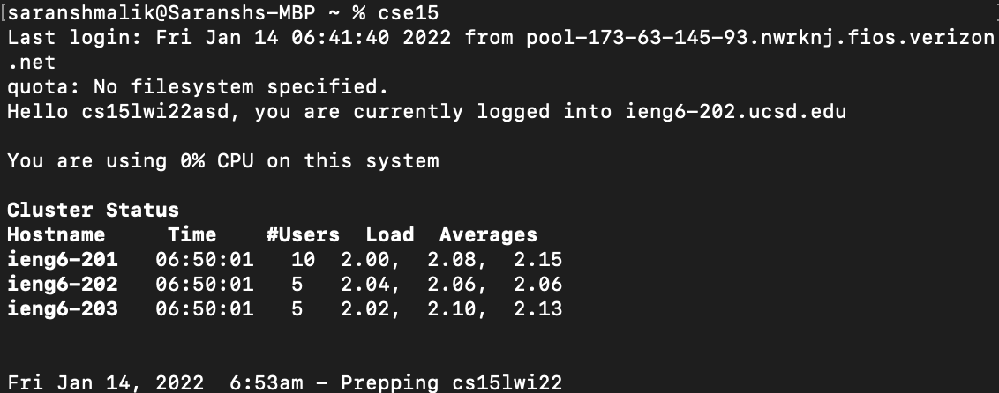

# Lab Report 1

## Step 1: Installing VS Code
---

VS Code is a code editor that can be used to write code in any programming language. It has a wide variety of packages that can be installed to support development in different languages, as well as a suite of built-ins to help with development.

It can be downloaded from the [VS Code website](https://code.visualstudio.com/download) for all major operating systems. In this tutorial, I use MacOS. I simply click the install button and follow the on-screen tutorial.

After following setup instructions, VS Code should start up with a blank screen as follows.

## Step 2: Remotely Connecting
---

We will now see how to remotely connect into the UC San Diego server so that we can upload files, work on documents, and run Java code remotely from anywhere in the world.

First, go to [Educational Technology Services](https://sdacs.ucsd.edu/~icc/index.php) and look up your UC San Diego login. You may need to reset your account password if this is the first time you're connecting. 

Once you've found your "@ieng6.ucsd.edu" username, open a Terminal window (or command prompt if you use Windows) and type `ssh <username>@ieng6.ucsd.edu`, with the \<username\> field changed to your username. As an example, this is what I typed.

The first time you connect, it may ask you if you trust the server. Just type `yes` since we are connecting to a trusted server.

At this point, it will ask you for your password. This is the password you set using the UCSD Educational Technology Services website.

After that, you will be connected to the server as shown below. 

## Step 3: Commands
---

Now that we're in the server, we can run some commands. Try running commands like 
* `pwd`
* `ls`
* `echo`
* `cd <directory name>`

Here are some examples.

## Step 4: Moving Files Using SCP
---

Now that we know how to use SSH to connect to a server, let's look at moving files to the server from our local machine. We can do this using SCP.

Create a file on your desktop, perhaps by using the command `touch`. Then, use the command `scp <filename> <server>:<location>`

Here is an example of me making a file `file.txt`, and moving it to the home folder `~` in my remote server. You will be asked for your password again.

At this point, the transfer is done and the file can be accessed from the remote server.

## Step 5: Setting an SSH Key
---

SSH Keys can be used to remove the need to input a password every single time you want to connect to, or transfer files to the server. 

On your terminal, type the command `ssh-keygen`. It will prompt you through a process in which it will generate a public and private key pair. 

Then, `scp` the public file generated (`Users/<yourname>/.ssh/id_rsa.pub`) to your server, in the directory `~/.ssh/authorized_keys`. You will be asked for your password. Once this is done, you should be able to `ssh` or `scp` into your server with no password prompt, making everything a lot faster.

## Step 6: Optimising Remote Running
---

One great way to optimise is to remove the need to memorise your username every time you want to connect. Instead of having to look up my `@ieng6.ucsd.edu` username, I have it aliased in my terminal profile. This depends machine to machine, but I know my Terminal profile uses the ZSH shell, which allows for customisable commands in the `~/.zprofile` document. All up-to-date Mac users will also use this profile. On older machines with Bash shells, it would be `~/.bashrc`.

As such, I just did `nano ~/.zprofile` to open up an editor for this document, added the line `alias cse15="ssh cs15lwi22asd@ieng6.ucsd.edu"`, and now can connect into my server simply by typing the command `cse15`.

In this way, not only do I not need a password, I also don't need by username, and can connect into the server with just 5 simple letters. This helps really optimise the remote connection process.
