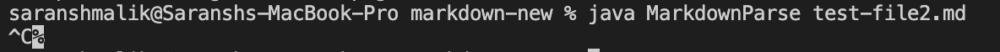
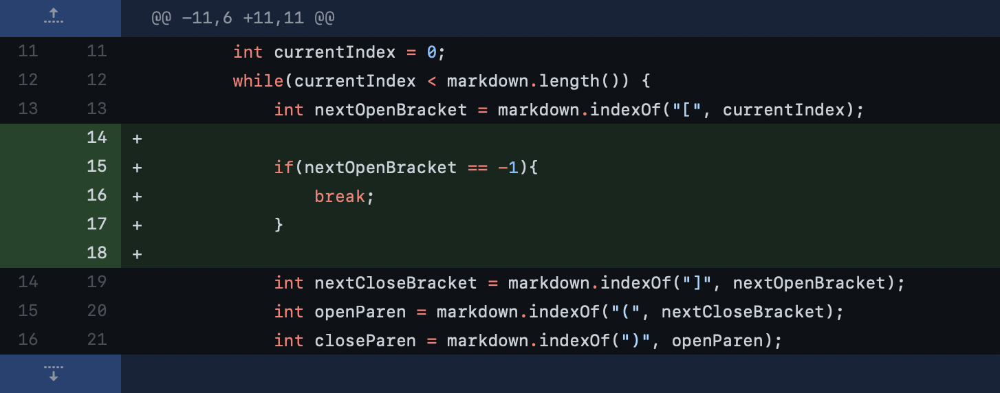
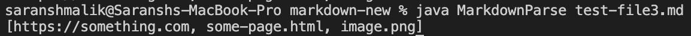
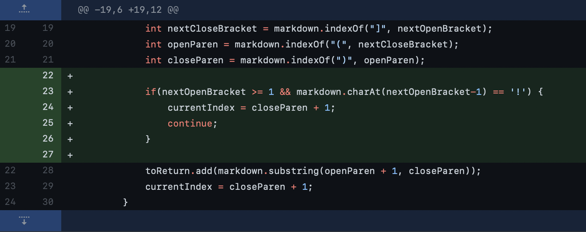
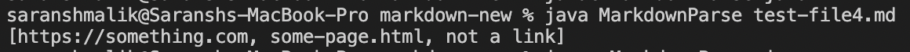
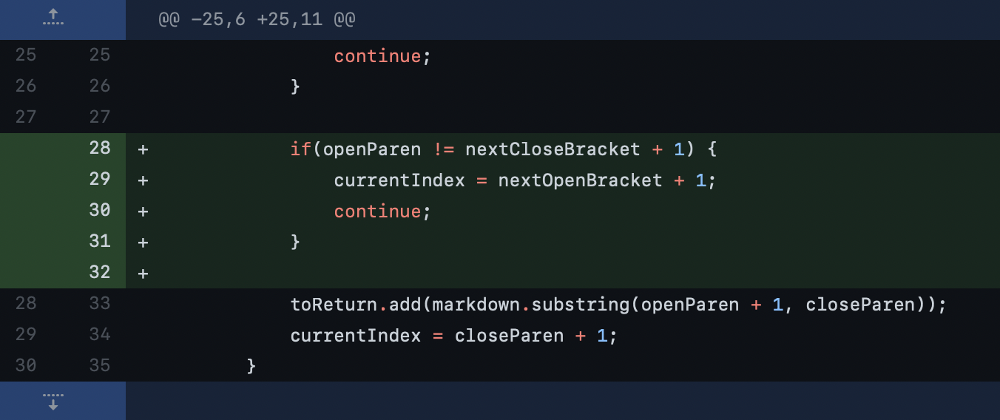

# Lab Report 2

## Error 1: Infinite loop in code
---

The first error our group found was the fact that the given code's breakout condition was when the index of the last link was at the end of the file. As such, if the file instead ends with plain-text, the program gets stuck in an infinite while loop.

A failure inducing input can be seen in [this test file](https://github.com/notSaranshMalik/markdown-new/blob/main/test-file2.md).

Running the given code on this test file produces this symptom:

Although it may be hard to see, the code just got stuck, and had to be manually terminated using the `ctr-c` keyboard shortcut. 

Our group solved this by adding a check for when another link is not found in the code. When this happens, the program terminates, regardless of if it's at the end of the file or not. 

[Here](https://github.com/notSaranshMalik/markdown-new/commit/3ec757ba8f6315a9b3b1e28800902953344973f6) is the commit. This is the git diff page:

The relationship between the bug and the symptom was clear. The lack of checks to see if there were any other links in the document meant the code never knew when to stop searching. The failure inducing input was just one of the possible inputs. In fact, any characters after the link would have the same effect. Our updated check makes sure to implement this one vital part of the logic in the code.

## Error 2: Image files counted as links
---

The second error our group found was the fact that this code treats images as simple links, even though the markdown format is different. Links are preceeded with a `!`.

A failure inducing input can be seen in [this test file](https://github.com/notSaranshMalik/markdown-new/blob/main/test-file3.md).

Running the updated code on this test file produces this symptom:

As you can see, it counts the `image.png` file as a link, which needs to be fixed. 

Our group solved this by simply checking if the character before the opening bracket was a `!`, and if it was, to ignore that link and continue to the next iteration of the loop.

[Here](https://github.com/notSaranshMalik/markdown-new/commit/8f39e679697b10627d582b29ceb62a15af2c69a7) is the commit. This is the git diff page:

The relationship between the bug and the symptom is a little more complex in this one, since image links are still technically links, but may not be what the spec was looking for. Although there was nothing wrong in the logic of our code for this one, the similar markdown syntax between images and links made this bug pop up. Any similar markdown syntax that may be introduced in the future may again break our code, since our checks simply check if a line is a link, not ruling out any other syntax. The failure inducing input is just one possible image, although any other image would produce the same failure.

## Error 3: Plaintext brackets counted as links
---

The third error our group found was the fact that any brackets or parentheses in the plaintext were treated as links by the code. 

A failure inducing input can be seen in [this test file](https://github.com/notSaranshMalik/markdown-new/blob/main/test-file4.md).

Running the updated code on this test file produces this symptom:

The plaintext `not a link` was treated as a link simply for being inside parentheses after a pair of brackets, which should not be the case.

Our group solved this by simply checking if the parentheses were directly after a pair of brackets, the exact markdown code for a link. In other situations, such as when the brackets and parentheses were seperated by any character, the link should be skipped.

[Here](https://github.com/notSaranshMalik/markdown-new/commit/a1033917108ccb30b434dcd179c0ce9f4dba9ac4) is the commit. This is the git diff page:

The relationship between the bug and symptom was something we missed earlier. The fact that we were just checking for a pair of parentheses and brackets, regardless of the fact that markdown only treated it as a link if they were directly next to each other meant we were getting a whole host of false positives. After implementing this logic, we can be fairly certain any previous failure inducing inputs that were plaintext have been successfully eliminated.
