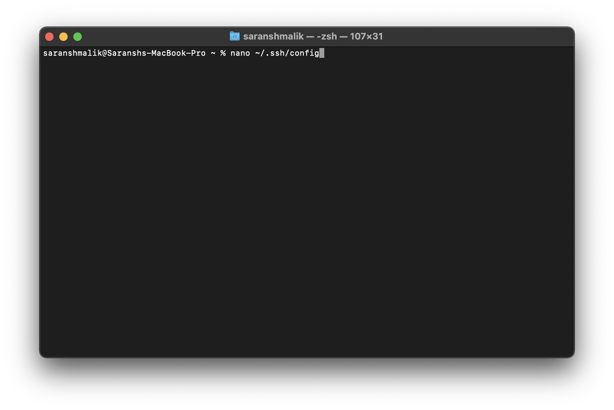
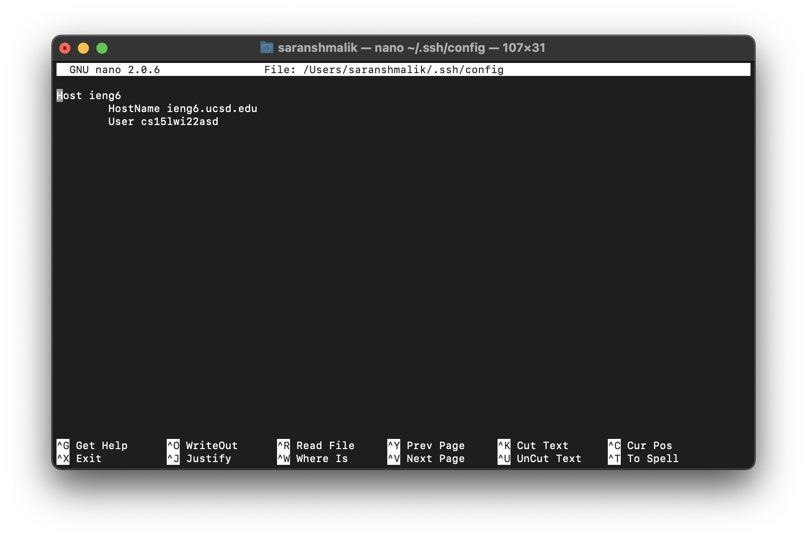
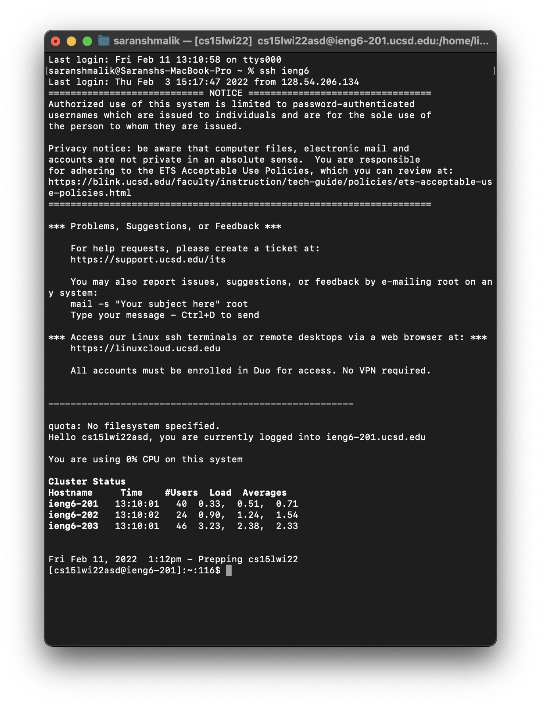
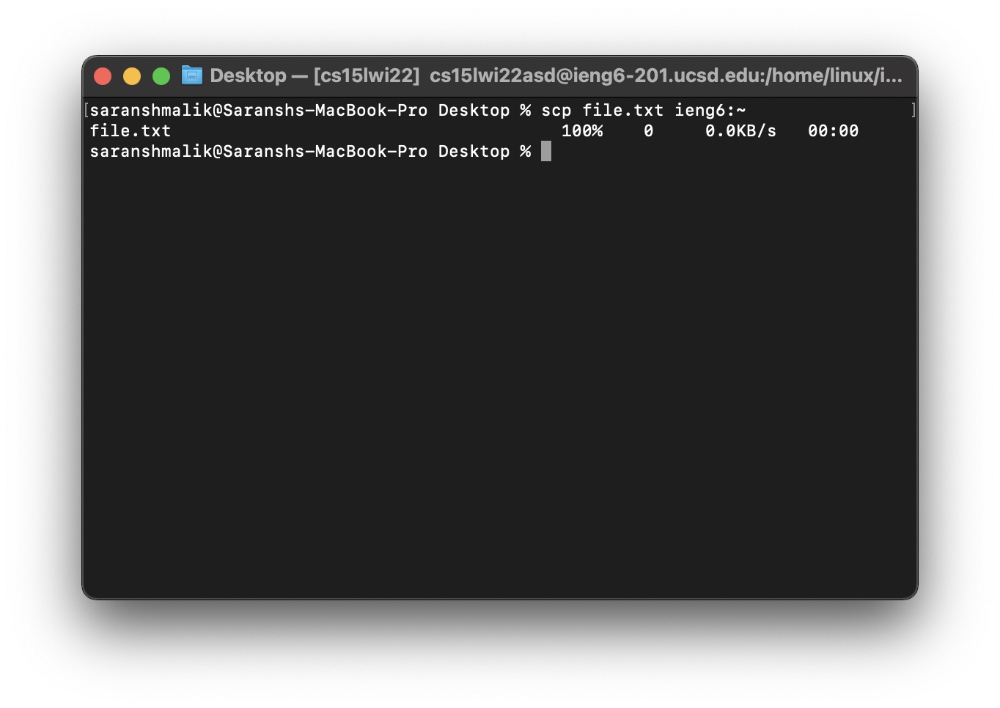

# Lab Report 3

## Streamlining SSH Configuration
---

SSHing into a remote server requires a command to be run that can often be long depending on how many characters your username, or the hostname of the server, is. This command is usually in the format of:

`ssh username@host`

After this, you often need to input a password before finally being able to connect into the server. 

In the [week 1 lab report](lab-report-1-week-2) we discussed a way to remove the need to input a password by adding an authorised key to a configuration file. We will now see how to add our username and hostname into a configuration file as well, to be able to ssh into the server with just a nickname.

First, in your terminal, type `nano ~/.ssh/config`. This will open up the SSH configuration file in your terminal in an editor called "Nano".



Here, you can use the arrow keys to navigate between lines, and type just by using your keyboard as usual. Type the following lines into the file, editing anything in `<>` with your corresponding data:

```
Host <nickname>
    HostName <hostname>
    User <username>
```

The `nickname` field will be the name you use to SSH in, so it can be anything that you can easily remember and type. The `hostname` field is the name of the server, the part the comes after the `@` when you SSH into a server. The `username` field is the name you use to SSH in, the data before the `@` when you SSH.

As an example, here is what my `~/.ssh/config` file looks like:



After you're done editing, use the key commands `ctr-x`, followed by `y` to save and exit the file. 

Now, you can SSH into my server by simply typing `ssh <nickname>`. For me, this simplifies the command from `ssh cs15lwi22asd@ieng6.ucsd.edu` to `ssh ieng6`. As easy as that!



This configuration file also works for SCP if you try to copy files into your server. As an example, instead of typing `scp <file> <username>@<host>:<directory>`, you can simply type `scp <nickname>:<directory>`. 



Again, this simplifies the command a lot, from `scp file.txt cs15lwi22asd@ieng6.ucsd.edu:~` to `scp file.txt ieng6:~`.

Not only does this make it shorter to SSH into your server, it also means you have less stuff to memorise, such as complicated usernames or hostnames.
