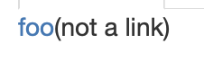

# Lab Report 5

## Finding differences
---

After cloning the week 9 directory of Markdown-Parse, and pulling the latest version of my Markdown-New implementation from GitHub, I modified the `script.sh` file to run MarkdownParse and copy all the outputs into a file with the file name included. Here is the script:

```
echo "" > output.txt   # To empty the file
for file in test-files/*.md;
do
  echo "$file" >> output.txt
  java MarkdownParse $file >> output.txt
done
```

I ran this on both my implementation (`markdown-new`) and the instructor implementation (`markdown-parse`). From this, I got two seperate output files, which I then ran `diff` on. Here's a short snippet of the `diff` file I got.

```
213c213
< [url]
---
> []
231c231
< [baz]
---
> []
271c271
< []
---
> [/bar\* "ti\*tle"]
493c493
< []
```

As you can see, there were multiple files in which my implementation and the instructor implementation differed. Two of the ones I found interesting were `519.md` and `567.md`. 

## Test file 519

This is what test file 519 looks like:
```
](uri2)](uri3)
```

Running markdown-parse on `519.md` yields this output:
```
[uri1]
```

Running markdown-new on `519.md` yields this output:
```
[]
```

Using the commonmark.js site, it looks like there should be no links on the site, rather just an image linking to uri3. This looks like it's because all the brackets are matched, and everything inside the ![] is treated as plain text describing the image, not a link. Hence, it looks like my implementation is the one that yields the correct response. 

That said, these specifications seem extremely loose, because opening the md file with Safari seems to yield a link, not an image, in which case the instructor specifications may be correct. However, since CommonMark is a specification that we have been using for a while, using that specification, it seems like my implementation provides the correct response.

The fix to this problem looks to be quite complicated. A variable could be defined to count the bracket matching depth, so the first `[` would make the variable 1, then the second one would make it 2, with closing brackets reducing it by 1, and so on. That way only depth 0 brackets would be matched, ignoring everything inside as plain text.

To be more specific, this part of `Markdown-Parse` requires bracket matching checks between the first and the second line, where I have added a comment:
```
int nextCloseBracket = markdown.indexOf("]", nextOpenBracket);

// Add a while loop, modifying a variable to find a matching closing bracket, using that as the nextCloseBracket, rather than the one just found.

int openParen = markdown.indexOf("(", nextCloseBracket);
```

The openParen index should only be searched after the matching closing bracket has been found. This way anything inside the plaintext description of the image is not treated as a link. 

## Test file 567

This is what test file 567 looks like:
```
[foo](not a link)

[foo]: /url1
```

Running markdown-parse on `567.md` yields this output:
```
[]
```

Running markdown-new on `567.md` yields this output:
```
[not a link]
```

Using the commonmark.js site, the render is something I never expected. This is what it looks like:



Not only is the text inside brackets not a link, but the text that it's linking to is a link, defined by a link _below_ the other text. Looking deeper into the specification, I noticed that this is how footnotes are defined. That original text is not a link, since spaces in the link make it plaintext. However, the last line defined the text `[foo]` as a footnote, linking to `/url1`.

What this means is neither implementation actually got this test case correct. The correct answer should have been:
```
[/url1]
```

Theres a few problems to solve here. First, in my implementation, there should be a check to invalidate any links that have spaces in them. In fact, after finding a link, I already check to make sure it's not formatted incorrectly. Right after that, there should be a check to make sure no spaces exist, right before adding it to the return list. I've commented it here below:
```
if(openParen != nextCloseBracket + 1) {
    currentIndex = nextOpenBracket + 1;
    continue;
}

// HERE is where I can add a check to make sure markdown.substring(openParen + 1, closeParen) does not contain " ", using the indexOf method

toReturn.add(markdown.substring(openParen + 1, closeParen));
```

The second problem here is much larger, which is the fact that both implementations completely ignore footnotes. Not only do links have to be searched within `[](this_space_here)`, they also have to be searched within `[]: this_space_here`. This requires an entirely new function that looks not only for opening and closing brackets, but also brackets followed by colons, at the end of the file. Rather than implementing this in the same function that searches for links, there could be a new function that searches for footnotes. 

This is not something that I can easily show in the code, to show which line is incorrect, since it's the logic of the code itself that's incorrect. A new function needs to be created, which can be called in the main method, as such:
```
public static void main(String[] args) throws IOException {
    Path fileName = Path.of(args[0]);
    String contents = Files.readString(fileName);
    ArrayList<String> links = getLinks(contents);

    ArrayList<String> links = getFootnoteLinks(contents); // A new method needs to be made to search for all of these footnotes

    System.out.println(links);
}
```

## Conclusion

In general, the second issue is a much larger issue, not with an edge case, but rather with a whole part of the specification that was missed out in both implementations. Searching for links in footnotes is another completely new feature that needs to be implemented. 

But this isn't even the end of our problems. In modern versions of Markdown, automatic URL linking is a feature, which turns plaintext links into clickable links too. In this way, our implementations miss out on numerous links that should in fact be found.

Since there exist differences in even Markdown renderers, such as Github vs. VSCode vs. CommonMark vs. Safari, a lot of edge cases will always exist regardless of implementation, hence finding errors in logic such as our disregard of footnotes is the main thing to focus on.